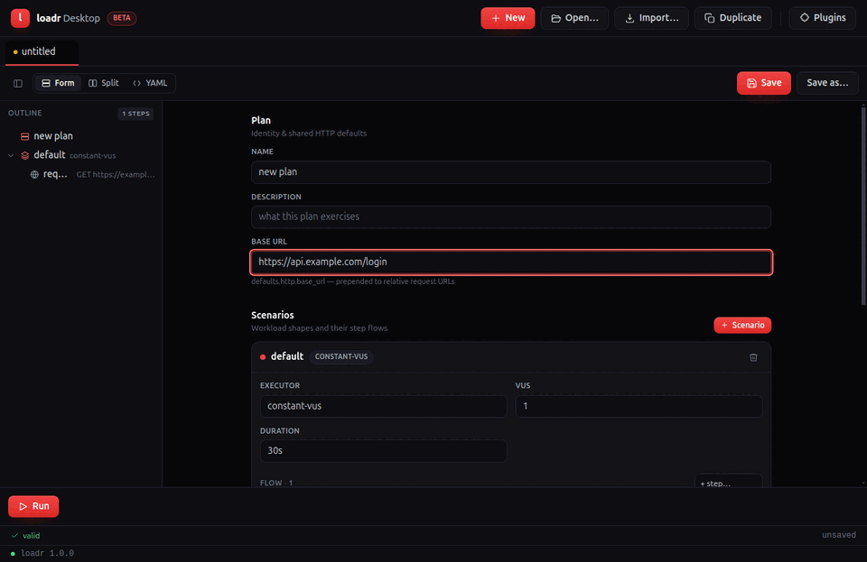

# loadr Desktop

A desktop GUI for [loadr](https://loadr.io): compose, manage, save and run test
plans with live results. The app is a **front-end over the loadr CLI** — it
spawns a bundled `loadr` binary for validation, schema, running and plugins, so
the GUI and the CLI can never disagree about what a plan means.

Stack: Electron + TypeScript, React 19 + Vite 6 + Tailwind 4 (renderer), Vitest
(unit), Playwright-for-Electron (e2e), electron-builder (packaging).



> The demo above is generated from the real app driven by Playwright (see
> `e2e/screenshots.mjs` + `e2e/run-shots.mjs`): launch → compose → outline →
> live run dashboard. Regenerate with `node e2e/screenshots.mjs` then assemble
> with ImageMagick. A continuous screen recording needs a display; CI is
> headless (xvfb), so the committed demo is the frame-assembled GIF.

## Status — built in milestones (see `goals/desktop-gui/`)
- [x] **M1** — scaffold, secure IPC, bundled-loadr bridge, open-YAML→render, round-trip tests
- [x] **M2** — schema-shaped form editor + Monaco two-way sync
- [x] **M3** — drag-and-drop composition + tabs + manage/import
- [x] **M4** — run + live metrics + results + history/compare
- [x] **M5** — plugins panel
- [~] **M6** — electron-builder packaging + CI matrix + Playwright-for-Electron
  acceptance suite (authored; runs in CI under xvfb — see note below)
- [ ] M7 — semantic-release + signed multi-platform artifacts
- [x] **Composer polish** — brand design system (shared loadr palette + UI
  primitives), **optional** YAML view (Form / Split / YAML toggle, forms-first),
  and **real forms for every step kind** with recursive nested-step editors
  (request, think_time, js, group, repeat, while, if, random, foreach, switch,
  during, retry, parallel, rendezvous) — composing a plan never requires YAML

## Develop
```bash
cd desktop
npm install
npm run dev          # launch the app (needs a display)
npm test             # unit + round-trip tests (headless)
npm run typecheck
npm run lint
```

### The loadr binary
The app resolves loadr in this order: **bundled** (`resources/bin/loadr` in a
packaged build) → `$LOADR_BIN` → `PATH`. For local dev, either `cargo build
-p loadr-cli` (the app/tests find `../target/{debug,release}/loadr`) or set
`LOADR_BIN`. The round-trip tests that call `loadr validate` are skipped if no
binary is found (the structural round-trip still runs).

## Round-trip guarantee
`src/shared/plan.ts` parses YAML → model and serializes model → YAML.
`src/shared/plan.test.ts` proves, over the repo's `examples/` corpus, that
parse→serialize→parse preserves the plan's data **and** that the serialized YAML
is accepted by `loadr validate`. A GUI edit that produces invalid YAML is a bug.

## Acceptance suite (`e2e/`)
Playwright-for-Electron specs that launch the built app and drive the real DOM
(`goals/desktop-gui/acceptance-suite.md`). They run in **CI** on the Linux
matrix leg under `xvfb` (Node 22) — the `e2e` job in `desktop.yml`. Locally:
`npm run e2e` (needs a display, e.g. `xvfb-run -a npm run e2e`).

## Known blockers (environment-dependent)
- **Local e2e in a bare sandbox**: Electron's window needs a display; without
  `xvfb` it can't launch (and `--ozone-platform=headless` segfaults on some
  hosts). CI installs `xvfb` and runs the suite there. Node 24 also trips a
  Playwright TS-loader bug on relative spec imports; CI pins **Node 22**.
- **Code-signing / macOS notarization** (M7): needs Apple/Windows certs supplied
  as CI secrets (`CSC_LINK`, `APPLE_ID`, …); the package job builds **unsigned**
  when they're absent.
